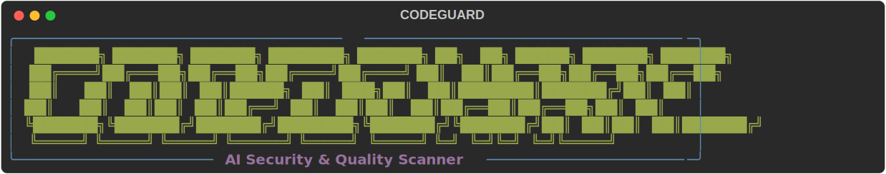
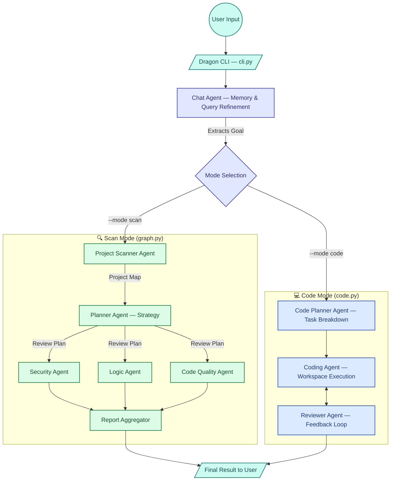
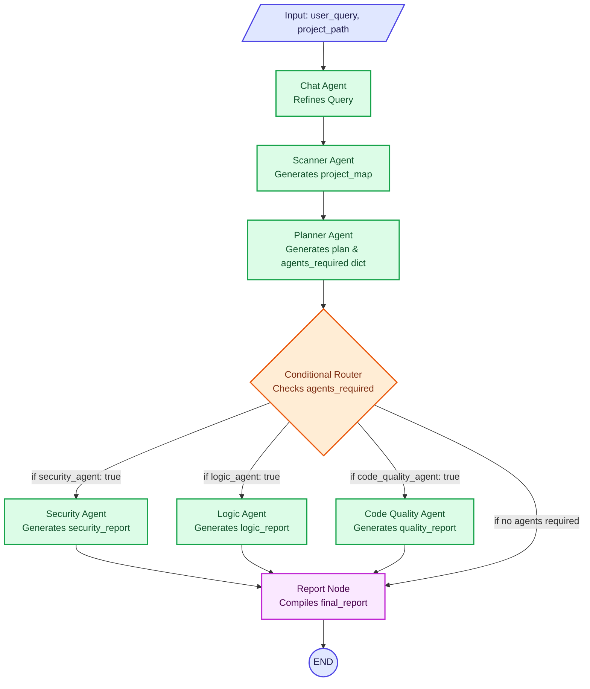
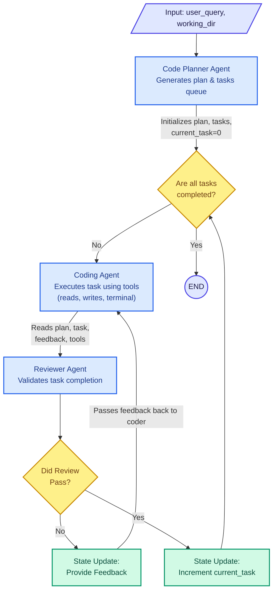

# AI Agent System


This repository houses a powerful, dual-mode multi-agent system built with **LangGraph** and **Langchain Google GenAI**. The system is designed to autonomously analyze, review, and write code by orchestrating specialized AI agents.

Both modes utilize Google's Gemini LLMs and structured state-graphs to handle planning, context gathering, and execution.

---

## High-Level Architecture

The system features a single CLI entry point (`cli.py`) that acts as a router, dropping the user into one of two specialized state graphs based on the mode provided:

1.  **Scan Mode (`--mode scan`)**: Analyzes an existing repository for security vulnerabilities, logic errors, and code quality issues.
2.  **Code Mode (`--mode code`)**: An autonomous coding agent that plans out a feature or fix, breaks it into tasks, and iteratively writes code until a reviewer agent approves.



---

## Detailed Flow: Scan Mode (`graph.py`)

In **Scan Mode**, the agent system acts as a multi-threaded code reviewer. The state graph passes an `AgentState` containing the project map, review plan, and individual reports between nodes.

### How the Flow Works:

1.  **Input & Chat Memory**: The CLI collects the user query and project path. A `Chat Agent` refines the user's raw input into a concise, actionable goal (and respects exclusions, e.g., "Skip security checks").
2.  **Context Gathering**: The `Project Scanner` uses terminal tools to list files, read directories, and build a high-level `project_map` of the codebase.
3.  **Planning & Routing**: The `Planner Agent` consumes the map and query to generate a review `plan`. It also outputs a structured dictionary (`agents_required`) dictating which specific review agents should run.
4.  **Parallel Execution**: The state graph uses conditional routing to trigger the `Security`, `Logic`, and `Code Quality` agents. These agents run concurrently, each appending their findings to the state.
5.  **Aggregation**: The `Report Node` formats the individual reports into a single, comprehensive markdown output.



---

## Detailed Flow: Code Mode (`code.py`)

In **Code Mode**, the system acts as an autonomous pair programmer. It features an iterative feedback loop where code is written, reviewed, and rewritten until it passes validation.

### How the Flow Works:

1.  **Task Breakdown**: The `Code Planner Agent` looks at the user query and generates a step-by-step implementation plan. This is converted into an ordered queue of `tasks` (e.g., [1. Setup Node project, 2. Write UI, 3. Add API integration]).
2.  **Execution (Coder)**: The `Coding Agent` is given the current task, the overarching plan, and access to an array of tools (file reading, writing, terminal commands). It executes the task in the actual file system.
3.  **Validation (Reviewer)**: Once the coder finishes, the `Reviewer Agent` analyzes the changes made. It checks if the specific task requirements were met without breaking existing functionality.
4.  **Feedback Loop**:
    *   If the reviewer **fails** the code, it populates `feedback_on_current_task_ifany`. The graph routes back to the Coder, which tries again with the feedback in mind.
    *   If the reviewer **passes** the code, `current_task` is incremented.
5.  **Completion**: This loop repeats until `current_task` exceeds the number of items in the queue, at which point the graph terminates.



---

## Usage

Execute the vulnerability scanner or the coding agent using the Dragon CLI. The CLI features rich progress spinners and interactive prompts.

```bash
# Scan Mode (Vulnerability & Quality analysis)
python cli.py --mode scan -q "Find bugs" -p /path/to/project

# Code Mode (Autonomous coding & building)
python cli.py --mode code -q "Build a tic tac toe app" -p /path/to/project

# Interactive Mode (Prompts for inputs)
python cli.py --mode code
```
*(Make sure to specify a valid absolute or relative path to your project).*

---

## Environment Variables

Create a `.env` file in the root directory with the following variables:

```env
GOOGLE_API_KEY_1=
GOOGLE_API_KEY=

GOOGLE_API_KEY_2=
GOOGLE_API_KEY_3=
SERPAPI_KEY=
OPENROUTER_API_KEY=
GROQ_API_KEY=
AGENT_WORKING_DIR=
```

---

## License
This project is open-source. Feel free to use and modify the agents for your personal workflows.
