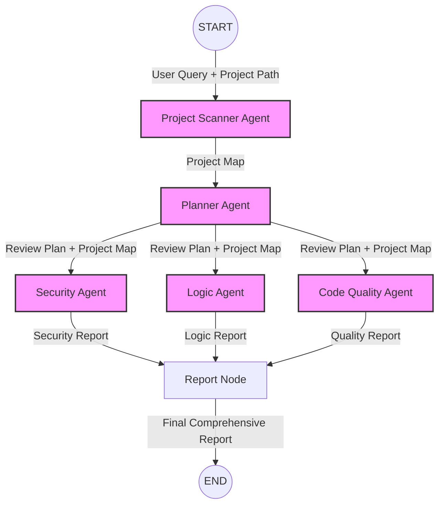
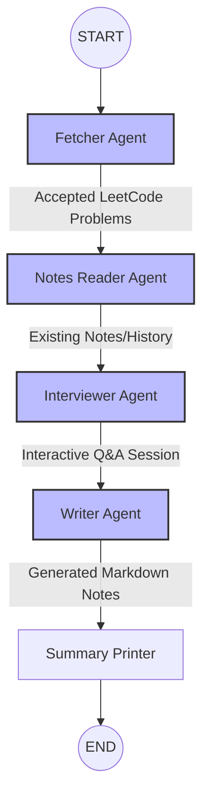

# AI Agent System 🤖

This repository houses two powerful AI-driven multi-agent systems built with **LangGraph** and **Langchain Google GenAI**:

1. **Vulnerability & Code Analysis Agent System** (`main.py`)
2. **DSA Note-Making Reflection Agent** (`prac.py`)

Both systems utilize Google's Gemini LLMs to autonomously orchestrate complex workflows involving planning, interviewing, analyzing, and reporting.

---

## 1. Vulnerability & Code Analysis Agent System

A multi-agent software analysis tool that autonomously scans a local repository, understands its architecture, plans a thorough code review, and produces a final comprehensive report on security, logic, and code quality.

### 🏛️ Architecture & Flow

The system employs a state graph where different specialized AI agents take turns analyzing the project based on the user's query.



### 🧩 Agents Involved

- **Project Scanner Agent**: Recursively explores the given project path using terminal and file-listing tools. It identifies languages, frameworks, entry points, architecture, and categorizes review targets.
- **Planner Agent**: Consumes the Project Map and the user's initial query to formulate a targeted review plan.
- **Security Agent**: Focuses strictly on identifying vulnerabilities (e.g., Auth issues, API security, injections) without getting distracted by code quality.
- **Logic Agent**: Analyzes business services and workflows for logical bugs and edge-case failures.
- **Code Quality Agent**: Reviews core modules for maintainability, highlighting large classes, refactoring opportunities, and structural issues.
- **Report Node**: Aggregates the findings from the Security, Logic, and Code Quality agents into a unified, easy-to-read final report.

### 🚀 Usage

Execute the vulnerability scanner by running:
```bash
python main.py
```
*(Make sure to update the `project_path` and `user_query` in `main.py` before running).*

---

## 2. DSA Note-Making Agent

A personal reflection tool designed to automatically fetch your latest accepted LeetCode submissions, interview you about your approach, and generate well-structured, markdown-formatted revision notes.

### 🏛️ Architecture & Flow

This workflow runs sequentially, prompting you with follow-up questions to solidify your understanding of Data Structures and Algorithms.



### 🧩 Agents Involved

- **Fetcher Agent**: Calls the LeetCode API to fetch your recently accepted problems.
- **Notes Reader Agent**: Checks your local `notes/` directory for any existing notes on those problems to provide historical context.
- **Interviewer Agent**: Acts as an interactive DSA coach. It engages you in the terminal, asking about your confidence, approach, patterns used, time complexity, and edge cases.
- **Writer Agent**: Compiles your answers into a clean, interview-ready Markdown file (saved in `notes/`), including code patterns and a revision history.
- **Summary Printer**: Displays a dashboard of the updated or newly created notes.

### 🚀 Usage

Ensure your `LEETCODE_USERNAME` is correctly set in `prac.py`, then run:
```bash
python prac.py
```

---

## 🛠️ Setup & Installation

1. **Clone the repository:**
   ```bash
   git clone <your-repo-url>
   cd lanchain
   ```

2. **Set up a Virtual Environment (Recommended):**
   ```bash
   python -m venv .venv
   source .venv/bin/activate  # On Windows: .venv\Scripts\activate
   ```

3. **Install Dependencies:**
   *(Ensure you have Langchain, LangGraph, and Google GenAI SDKs installed)*
   ```bash
   pip install langchain langchain-google-genai langgraph requests
   ```

4. **Environment Variables:**
   Set your Gemini API key in your environment or a `.env` file:
   ```bash
   export GEMINI_API_KEY="your_api_key_here"
   ```

## 📄 License
This project is open-source. Feel free to use and modify the agents for your personal workflows.
