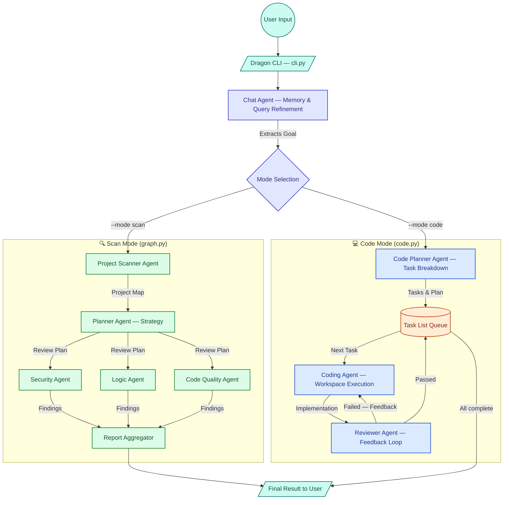

# AI Agent System 🤖

This repository houses two powerful AI-driven multi-agent systems built with **LangGraph** and **Langchain Google GenAI**:

1. **Vulnerability & Code Analysis Agent System** (`main.py`)
2. **DSA Note-Making Reflection Agent** (`prac.py`)

Both systems utilize Google's Gemini LLMs to autonomously orchestrate complex workflows involving planning, interviewing, analyzing, and reporting.

---

## 1. Vulnerability & Code Analysis Agent System

A multi-agent software analysis tool that autonomously scans a local repository, understands its architecture, plans a thorough code review, and produces a final comprehensive report on security, logic, and code quality.

### 🏛️ Architecture & Flow

The system employs a state graph where different specialized AI agents take turns analyzing the project based on the user's query.



### 🧩 Agents Involved

- **Project Scanner Agent**: Recursively explores the given project path using terminal and file-listing tools. It identifies languages, frameworks, entry points, architecture, and categorizes review targets.
- **Planner Agent**: Consumes the Project Map and the user's initial query to formulate a targeted review plan.
- **Security Agent**: Focuses strictly on identifying vulnerabilities (e.g., Auth issues, API security, injections) without getting distracted by code quality.
- **Logic Agent**: Analyzes business services and workflows for logical bugs and edge-case failures.
- **Code Quality Agent**: Reviews core modules for maintainability, highlighting large classes, refactoring opportunities, and structural issues.
- **Report Node**: Aggregates the findings from the Security, Logic, and Code Quality agents into a unified, easy-to-read final report.

### 🚀 Usage

Execute the vulnerability scanner or the coding agent using the Dragon CLI:

```bash
# 🔍 Scan Mode (Vulnerability & Quality analysis)
python cli.py --mode scan -q "Find bugs" -p /path/to/project

# 💻 Code Mode (Autonomous coding & building)
python cli.py --mode code -q "Build a tic tac toe app" -p /path/to/project

# Interactive mode
python cli.py --mode code
```
*(Make sure to specify your valid project path).*

---


## 📄 License
This project is open-source. Feel free to use and modify the agents for your personal workflows.
